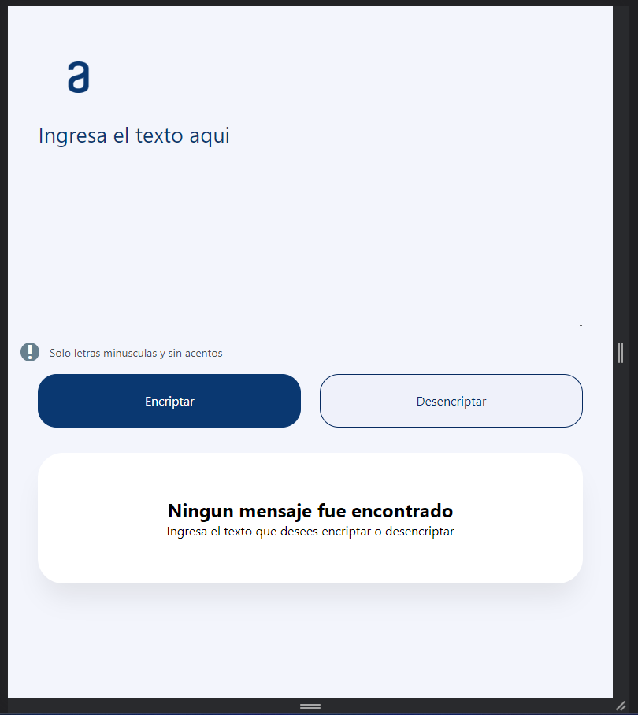
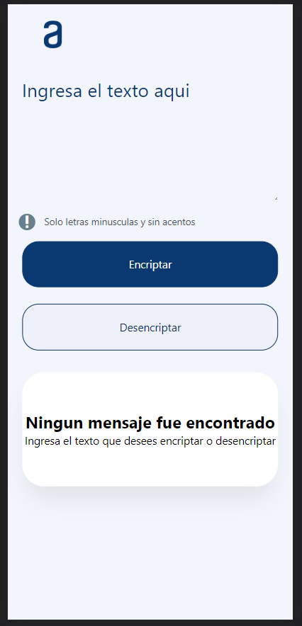

# Encriptador de texto con Java Script
reto de Alura latam en donde se crea un encriptador de texto con html css y javascript

para estra pagina se utilizo [GitHub Pages](https://daveoval.github.io/encriptador-texto-JS/) para el despliegue.

## Vista Desktop:

## Vista Tablet:

## Vista Movil:

